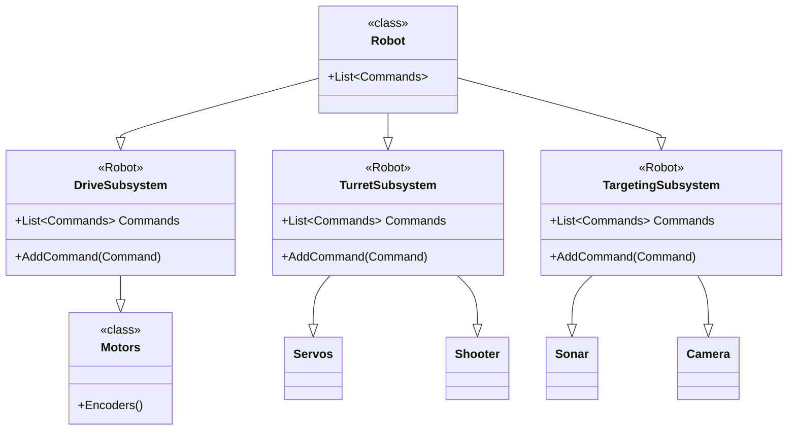
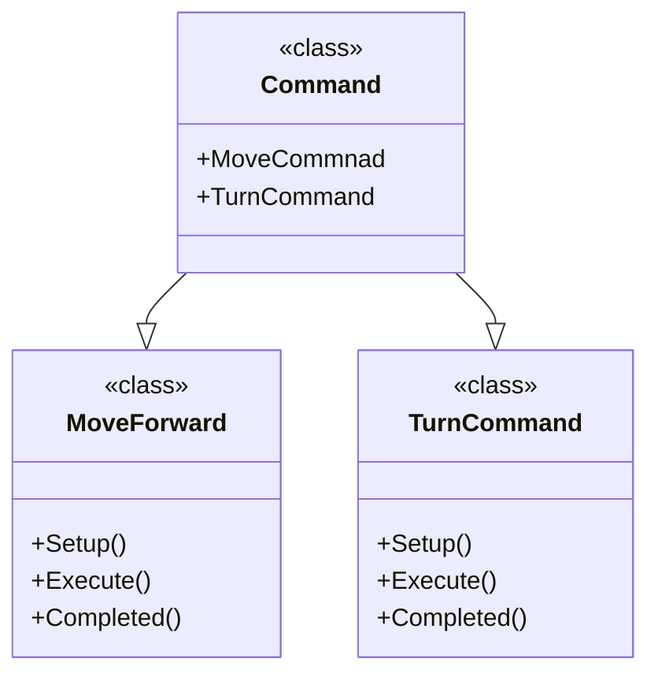
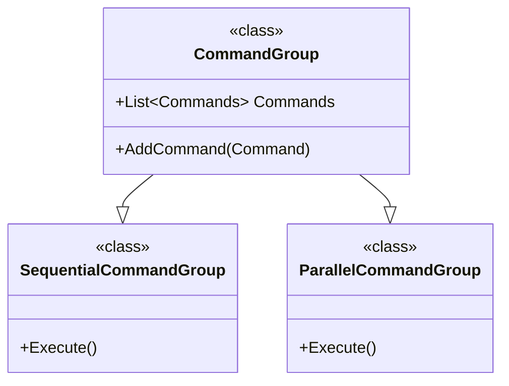

# https://mermaid.js.org/syntax/classDiagram.html

## First Object Model

```mermaid
classDiagram
    class Robot {
        <<class>>
        +List~Commands~ 
    }

    class DriveSubsystem {
        <<Robot>>
        +List~Commands~ Commands
        +AddCommand(Command)
    }

    class TurretSubsystem {
        <<Robot>>
        +List~Commands~ Commands
        +AddCommand(Command)
    }

    class TargetingSubsystem {
        <<Robot>>
        +List~Commands~ Commands
        +AddCommand(Command)
    }

    class Motors {
        <<class>>
        +Encoders()
    }

    class Servos {

    }

    class Shooter {

    }

    class Sonar {

    }

    class Camera {

    }

    Robot --|> DriveSubsystem

    Robot --|> TurretSubsystem

    Robot --|> Targeting Subsystem

    DriveSubsystem --|> Motors

    TurretSubsystem --|> Servos

    TurretSubsystem --|> Shooter

    TargetingSubsystem --|> Sonar

    TargetingSubsystem --|> Camera

```

## Second Object Model

```mermaid
classDiagram
    class Command {
        <<class>>
        +MoveCommnad
        +TurnCommand
    }

    class MoveForward {
        <<class>>
        +Setup()
        +Execute()
        +Completed()
    }

    Command --|> MoveForward

    class TurnCommand {
        <<class>>
        +Setup()
        +Execute()
        +Completed()
    }

    Command --|> TurnCommand

```

## Third Object Model

```mermaid
classDiagram
    class CommandGroup {
        <<class>>
        +List~Commands~ Commands
        +AddCommand(Command)
    }

    class SequentialCommandGroup {
        <<class>>
        +Execute()
    }

    CommandGroup --|> SequentialCommandGroup

    class ParallelCommandGroup {
        <<class>>
        +Execute()
    }

    CommandGroup --|> ParallelCommandGroup

```